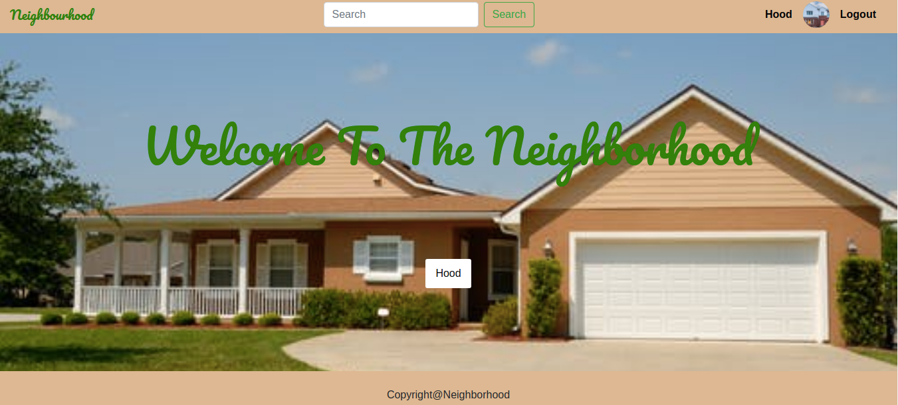

# Neighbourhood!!
## Author
[clara metto]()
# Description
This is a web application where users can set profile about them and their location/neighborhood name,They can find a list of different businesses in the neighborhood, contact information and also create posts.

##  Live Link
 ("https://salbhood.herokuapp.com/")
## Screenshots
###### Screenshot 1




## User Story
* View different projects from the Application
* Click a single project to expand it and view the details of that post
* Search for projects by different names.
* Rate a project according to usability, content and design.
* Update profile.
## Setup and Installation
##### Clone the repository:
 ```bash
```
##### Navigate into the folder and install requirements
 ```bash
cd neighbourhood pip install -r requirements.txt
```
##### Install and activate Virtual
 ```bash
- python3 -m venv virtual - source virtual/bin/activate
```
##### Install Dependencies
 ```bash
 pip install -r requirements.txt
```
##### Setup Database
  SetUp your database User,Password, Host then make migrate
 ```bash
python manage.py makemigrations hood
 ```
 Now Migrate
 ```bash
 python manage.py migrate
```
##### Run the application
 ```bash
 python manage.py runserver
```
##### Testing the application
 ```bash
 python manage.py test
```
Open the application on your browser `127.0.0.1:8000`.
## Technology used
* [Python3.8](https://www.python.org/)
* [Django==3.2.7](https://docs.djangoproject.com/en/2.2/)
* [Heroku](https://heroku.com)
## Known Bugs
* There are no known bugs
## Support and contact details
For more information,comments or clarification contact on clara.metto@student.moringaschool.com
### License
*MIT License*
Copyright (c) 2022 Clara Metto

Permission is hereby granted, free of charge, to any person obtaining a copy
of this software and associated documentation files (the "Software"), to deal
in the Software without restriction, including without limitation the rights
to use, copy, modify, merge, publish, distribute, sublicense, and/or sell
copies of the Software, and to permit persons to whom the Software is
furnished to do so, subject to the following conditions:

The above copyright notice and this permission notice shall be included in all
copies or substantial portions of the Software.

THE SOFTWARE IS PROVIDED "AS IS", WITHOUT WARRANTY OF ANY KIND, EXPRESS OR
IMPLIED, INCLUDING BUT NOT LIMITED TO THE WARRANTIES OF MERCHANTABILITY,
FITNESS FOR A PARTICULAR PURPOSE AND NONINFRINGEMENT. IN NO EVENT SHALL THE
AUTHORS OR COPYRIGHT HOLDERS BE LIABLE FOR ANY CLAIM, DAMAGES OR OTHER
LIABILITY, WHETHER IN AN ACTION OF CONTRACT, TORT OR OTHERWISE, ARISING FROM,
OUT OF OR IN CONNECTION WITH THE SOFTWARE OR THE USE OR OTHER DEALINGS IN THE
SOFTWARE.

Copyright (c) {2022} **clarametto**